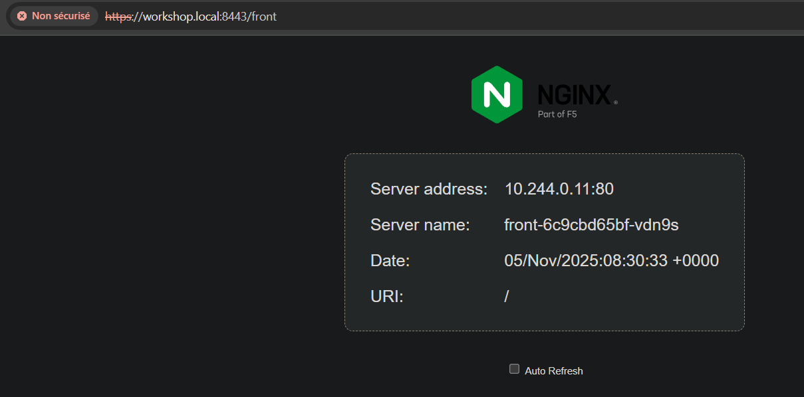

# TP Kubernetes - Ingress, TLS, ConfigMap & Secrets

Projet de déploiement d'applications web sur Kubernetes avec Ingress Controller, gestion TLS via cert-manager, et injection de configuration.

## 📋 Description

Ce projet démontre une architecture microservices complète sur Kubernetes avec :
- **Exposition via Ingress Controller** : Routage L7 (HTTP/HTTPS) avec NGINX
- **Sécurisation TLS** : Certificats auto-signés gérés par cert-manager
- **Gestion de configuration** : ConfigMap pour données non sensibles
- **Gestion de secrets** : Secret pour données sensibles (credentials)
- **Haute disponibilité** : 2 réplicas pour chaque service
- **Rewrite rules** : Réécriture d'URL pour un routage transparent

## 🏗️ Architecture

```
Client (Browser)
    ↓
Ingress NGINX Controller (TLS Termination)
    ├─→ /front → Service front → Pods front (nginxdemos/hello)
    └─→ /api   → Service api   → Pods api (httpbin)
```

### Composants déployés

- **Front** : Application de démonstration NGINX (nginxdemos/hello)
- **API** : Service HTTP de test (kennethreitz/httpbin)
- **Ingress Controller** : NGINX pour le routage L7
- **cert-manager** : Gestion automatique des certificats TLS
- **ConfigMap** : Injection de `BANNER_TEXT` dans les pods front
- **Secret** : Injection de `DB_USER` et `DB_PASS` dans les pods api

## 🔧 Prérequis

### Pour déploiement automatique (recommandé)
- **Linux** ou **macOS** (le script s'occupe du reste)
- Droits sudo pour l'installation des outils

### Pour déploiement manuel
- **Cluster Kubernetes** : Minikube ou Kind
- **kubectl** : Client Kubernetes
- **Ingress Controller** : NGINX Ingress
- **cert-manager** : Gestionnaire de certificats TLS

## 🚀 Déploiement

### Option 1 : Déploiement automatique (recommandé)

Le script `deploy.sh` s'occupe de tout :
1. ✅ Installe kubectl, kind, et helm si nécessaire
2. ✅ Crée un cluster kind avec port-mapping (8080, 8443)
3. ✅ Installe Ingress NGINX Controller
4. ✅ Installe cert-manager
5. ✅ Déploie toutes les ressources

```bash
# Rendre le script exécutable
chmod +x deploy.sh

# Lancer le déploiement complet
./deploy.sh
```

### Option 2 : Déploiement manuel (Kind)

```bash
# Créer le cluster avec port-mapping
cat > /tmp/kind-config.yaml <<EOF
kind: Cluster
apiVersion: kind.x-k8s.io/v1alpha4
nodes:
- role: control-plane
  extraPortMappings:
  - containerPort: 80
    hostPort: 8080
  - containerPort: 443
    hostPort: 8443
EOF

kind create cluster --name workshop --config /tmp/kind-config.yaml

# Installer Ingress NGINX
kubectl apply -f https://raw.githubusercontent.com/kubernetes/ingress-nginx/main/deploy/static/provider/kind/deploy.yaml

# Installer cert-manager
kubectl apply -f https://github.com/cert-manager/cert-manager/releases/download/v1.13.2/cert-manager.yaml

# Attendre que tout soit prêt
kubectl wait --namespace ingress-nginx --for=condition=available deployment --selector=app.kubernetes.io/component=controller --timeout=120s
kubectl wait --namespace cert-manager --for=condition=ready pod --selector=app.kubernetes.io/instance=cert-manager --timeout=120s

# Déployer les ressources
kubectl apply -f manifest.yaml
```

## 🌐 Accès aux applications

### Configuration du fichier hosts

Ajoutez cette ligne à votre fichier hosts :

**Linux/macOS** : `/etc/hosts`
```bash
sudo sh -c 'echo "127.0.0.1 workshop.local" >> /etc/hosts'
```

**Windows** : `C:\Windows\System32\drivers\etc\hosts` (en tant qu'Administrateur)
```
127.0.0.1 workshop.local
```

### URLs d'accès

**HTTP** :
- Front : http://workshop.local:8080/front
- API (headers) : http://workshop.local:8080/api/headers

**HTTPS** :
- Front : https://workshop.local:8443/front
- API (headers) : https://workshop.local:8443/api/headers

**⚠️ Note** : Acceptez le certificat auto-signé dans votre navigateur.

## 📦 Structure du projet

```
k8s_cours/
├── manifest.yaml       # Manifest Kubernetes complet (namespace, deployments, services, ingress)
├── deploy.sh          # Script de déploiement automatique
├── readme.md          # Ce fichier
└── images_cr/         # Captures d'écran
```

## 🔍 Détails du manifest.yaml

Le manifest contient toutes les ressources Kubernetes :

### 1. Namespace
```yaml
namespace: workshop
```
Isole toutes les ressources du projet.

### 2. ConfigMap
```yaml
BANNER_TEXT: "Hello M2 IR"
```
Injecté comme variable d'environnement dans les pods front.

### 3. Secret
```yaml
DB_USER: app
DB_PASS: changeMe123
```
Credentials injectés dans les pods api (encodés en base64 automatiquement).

### 4. ClusterIssuer (cert-manager)
Génère automatiquement des certificats TLS auto-signés pour l'Ingress.

### 5. Deployments & Services
- **Front** : 2 réplicas de nginxdemos/hello (port 80)
- **API** : 2 réplicas de kennethreitz/httpbin (port 80)

### 6. Ingress
- **Host** : workshop.local
- **TLS** : Certificat auto-signé (secret: web-tls)
- **Rewrite rules** : `/front` → `/`, `/api` → `/`
- **Paths** :
  - `/front(/|$)(.*)` → Service front
  - `/api(/|$)(.*)` → Service api

## ✅ Vérifications

### Vérifier les ressources

```bash
# État de tous les pods
kubectl get all -n workshop

# Pods en détail
kubectl get pods -n workshop

# Services
kubectl get svc -n workshop

# Ingress
kubectl get ingress -n workshop

# Certificat TLS
kubectl get certificate -n workshop
```

### Vérifier les logs

```bash
# Logs du front
kubectl logs -n workshop -l app=front

# Logs de l'API
kubectl logs -n workshop -l app=api

# Logs de l'Ingress Controller
kubectl logs -n ingress-nginx -l app.kubernetes.io/component=controller --tail=50
```

### Tester les services directement (sans Ingress)

```bash
# Port-forward vers le service front
kubectl port-forward -n workshop service/front 9090:80

# Dans un autre terminal
curl http://localhost:9090
```

## 🔄 Tests de rollback

### Simuler un déploiement défectueux

```bash
# Déployer une image cassée
kubectl set image deployment/front front=nginx:broken -n workshop

# Observer le rollout (ne devrait pas progresser)
kubectl rollout status deployment/front -n workshop
```

### Effectuer un rollback

```bash
# Retour à la version précédente
kubectl rollout undo deployment/front -n workshop

# Vérifier le statut
kubectl rollout status deployment/front -n workshop

# Voir l'historique
kubectl rollout history deployment/front -n workshop
```

## 🧹 Nettoyage

### Supprimer uniquement les ressources

```bash
# Supprimer le namespace (supprime tout dedans)
kubectl delete namespace workshop
```

### Supprimer le cluster complet

**Minikube** :
```bash
minikube delete
```

**Kind** :
```bash
kind delete cluster --name workshop
```

## 🐛 Troubleshooting

### Les pods ne démarrent pas

```bash
# Voir les détails du pod
kubectl describe pod <nom-du-pod> -n workshop

# Voir les logs
kubectl logs <nom-du-pod> -n workshop
```

### L'Ingress ne répond pas (404)

```bash
# Vérifier l'Ingress
kubectl describe ingress web -n workshop

# Vérifier les logs de l'Ingress Controller
kubectl logs -n ingress-nginx -l app.kubernetes.io/component=controller --tail=100

# Vérifier que le port-forward est actif (Minikube)
# Relancer si nécessaire
kubectl port-forward -n ingress-nginx service/ingress-nginx-controller 8080:80 8443:443
```

### Le certificat TLS n'est pas créé

```bash
# Vérifier cert-manager
kubectl get certificate,certificaterequest -n workshop

# Logs de cert-manager
kubectl logs -n cert-manager deploy/cert-manager --tail=100
```

### Erreur "connection refused" sur localhost:8080

- **Avec Minikube** : Assurez-vous que le `kubectl port-forward` est actif
- **Avec Kind** : Le port-mapping devrait être automatique si le cluster a été créé avec la config

## 📚 Concepts clés

| Concept | Description |
|---------|-------------|
| **Namespace** | Isolation logique des ressources |
| **ConfigMap** | Configuration non sensible (texte en clair) |
| **Secret** | Données sensibles (encodées base64) |
| **Deployment** | Gestion des pods avec réplication et rolling updates |
| **Service** | Point d'accès stable (load balancing) vers les pods |
| **Ingress** | Routage HTTP/HTTPS (Layer 7) vers les services |
| **ClusterIssuer** | Émetteur de certificats TLS (cert-manager) |
| **Rewrite** | Réécriture d'URL au niveau de l'Ingress |

## 📝 Notes techniques

- **Stratégie de déploiement** : RollingUpdate (zéro downtime)
- **Ressources** : Limits et requests définis pour éviter la surcharge
- **TLS Termination** : Le trafic est déchiffré au niveau de l'Ingress
- **Routage L7** : Basé sur le host et le path HTTP
- **Certificats** : Auto-signés (pour production, utiliser Let's Encrypt)

## 👨‍💻 Auteur

Enzo75001

## Résultat final 


